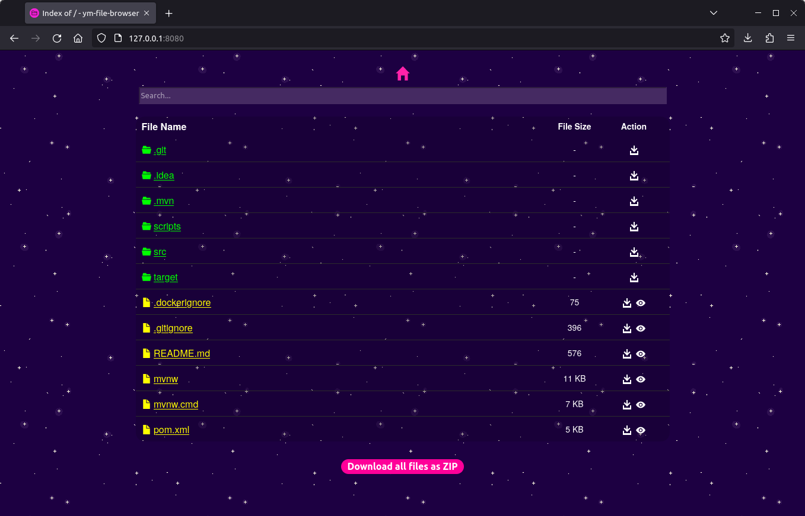

# ym-file-browser

ym-file-browser is a simple static file server



## Features
- static file serving
- file viewer to quickly page through all the items of a directory    
- partial / ranged download of files (great for large files, videos, etc...)
- download directories as a zip
- mobile friendly-ish
- design that sets a statement (?)

## How to Install
### Docker
```
docker run -v /your-dir:/data -p 8080:8080 YuuichiMizouka/ym-file-browser
```
### Java
- clone the repository `git clone https://github.com/YuuichiMizouka/ym-file-browser`
- build using maven `mvn install`
- run `java -DBASE_DIR="/your-dir" -jar ./target/quarkus-app/quarkus-run.jar`
- 
## Assets
- Icons by https://publicicons.org/
